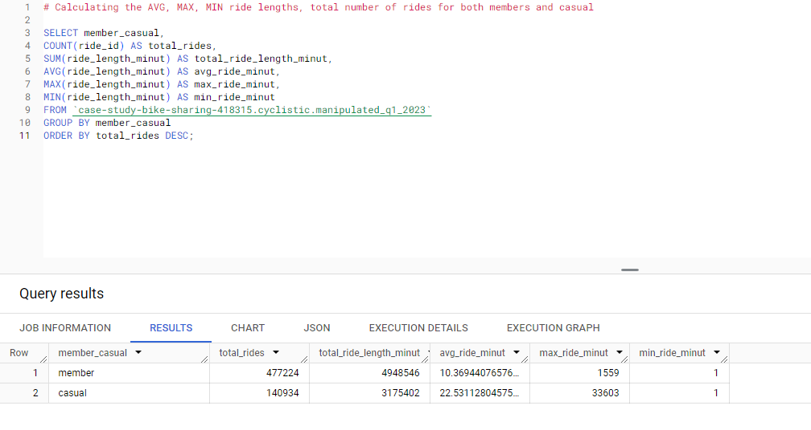
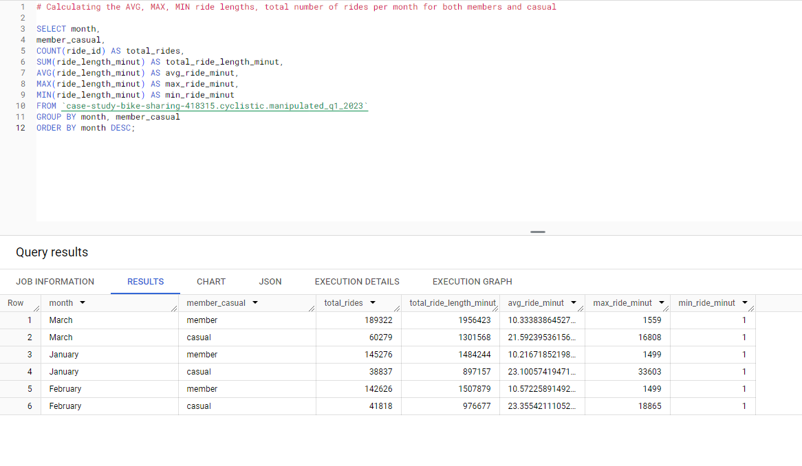
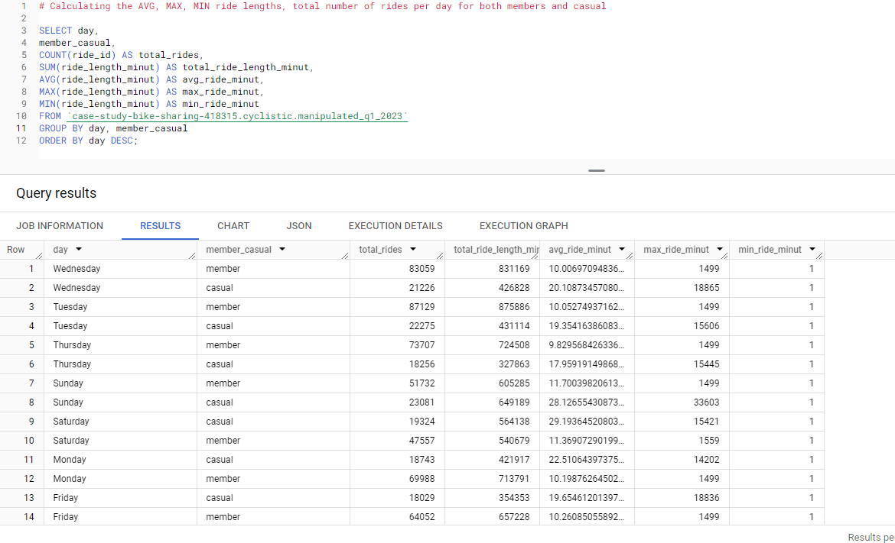
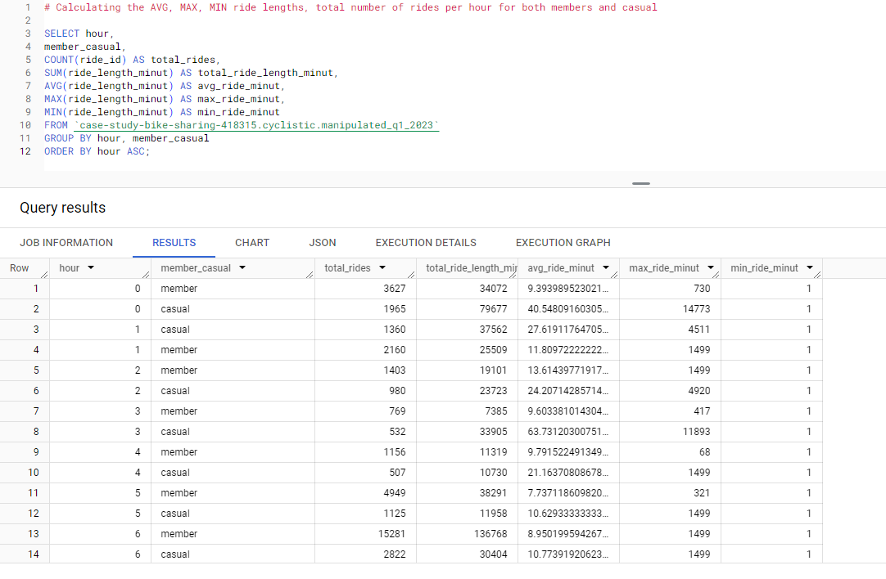
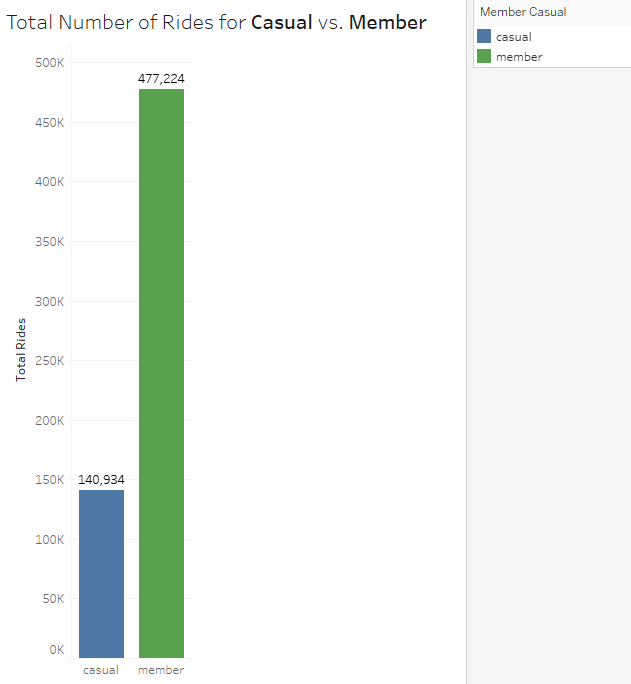
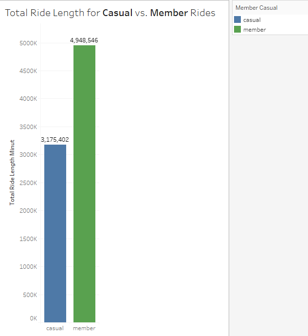
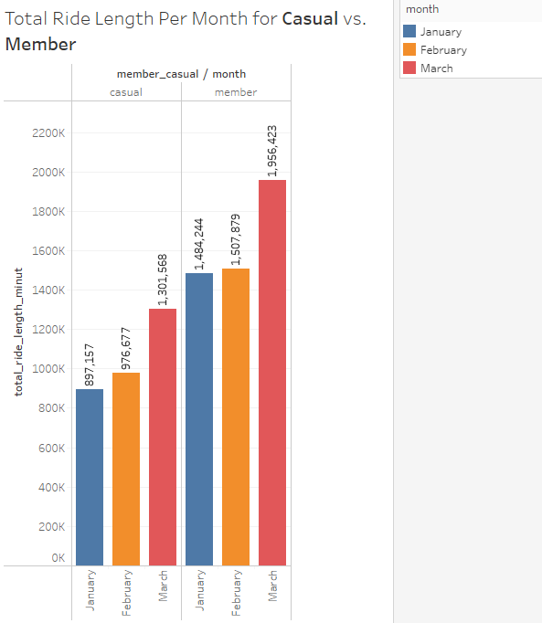
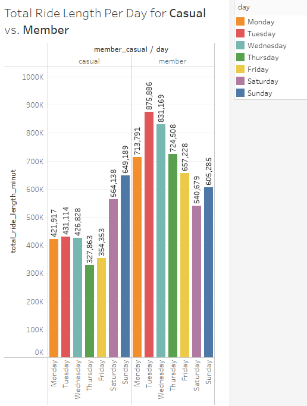
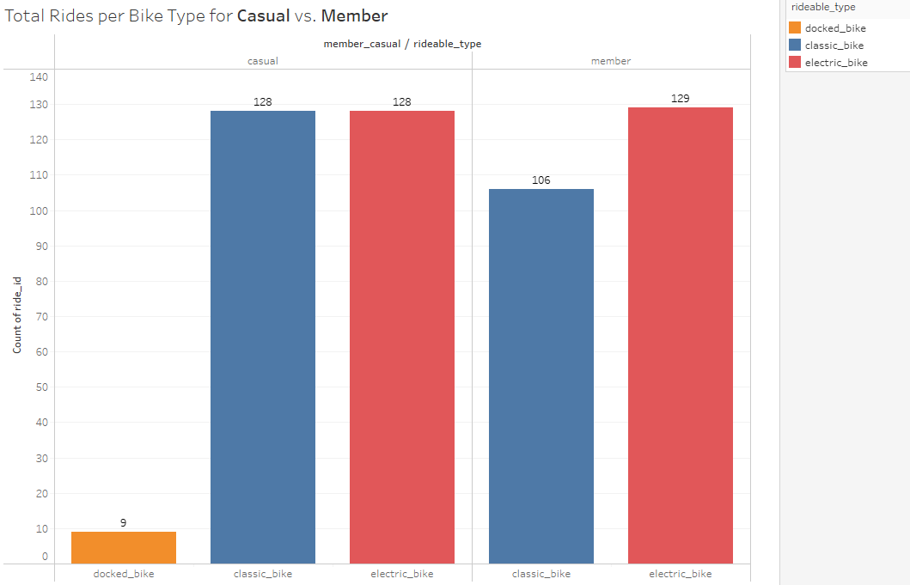

# **Case Study 1: How does a bike-share navigate speedy success?** 


*Image: Photo by <a href="https://unsplash.com/@dovilerm?utm_content=creditCopyText&utm_medium=referral&utm_source=unsplash">Dovile Ramoskaite</a> on <a href="https://unsplash.com/photos/people-riding-bike-x8rDSFN2DpY?utm_content=creditCopyText&utm_medium=referral&utm_source=unsplash">Unsplash</a>*
 
## Tools Used 

> 1. **Google Sheets** (Processing)
> 1. **Google Cloud BigQuery** (Analysis)
> 2. **Tableau Public** (Viz)

## Introduction

This case study is part of the Google Data Analytics Professional Certificate course and will focus on analysing Q1 data from a fictional bike-sharing company called Cyclistic.

### Stakeholders

> 1. **Lily Moreno** -> The marketing director, spearheads campaigns across multiple channels to promote the bike-share program.
> 2. **Cyclistic marketing analytics team** -> A team of data analysts that guides Cyclistic's marketing strategy through data collection, analysis, and reporting.
> 3. **Cyclistic executive team** -> The meticulous executive team will determine the approval of the recommended marketing program.

### About the Company 

Since 2016, Cyclistic's bike-share program has grown to include 5,824 bicycles across 692 stations in Chicago, allowing users to unlock and return bikes at any station. While initially targeting broad consumer segments, the focus now shifts to converting casual riders into annual members for greater profitability, with the marketing team planning to analyze historical trip data to inform targeted strategies.


## Process 

### Ask => Business Task 

> 1. *How do annual members and casual riders use Cyclistic bikes differently?*
> 2. *Why would casual riders buy Cyclistic annual memberships?*
> 3. *How can Cyclistic use digital media to influence casual riders to become members?*


### Prepare => Source, Organization & Credibility

- The data has been made available by **Motivate International Inc.** under this
[license](https://divvybikes.com/data-license-agreement), and it can be downloaded [here](https://divvy-tripdata.s3.amazonaws.com/index.html).
- The data analysed would encompass rider information over a quarter timeframe, extending from January 2023 to March 2023 (Q1), due to the large volume of data.
- The data is Reliable, Original, Comprehensive, Current, and Cited (ROCCC).


### Process => Cleaning & Transformation

- **Data Cleaning** (Google Sheets)
  - Checked for Duplicates and Blank values;
  - Removed the columns: *start_lat, start_lng, end_lat, end_lng, start_station_name,	start_station_id,	end_station_name, and	end_station_id*;
  - Added the column *ride_length*, and set the time format to HH:MM:SS;
  - Added the column *day_of_week*. and set the number format to number without decimals;
  - Sorting the tables (ascending, column *started_at*);

- **Data Transformation** (Google Cloud BigQuery)
   
  - Imported the data into BigQuery;
     
  - Merged the data - 3 datasets into 1 single dataframe using the UNION ALL function;
``` 
  SELECT *
FROM `case-study-bike-sharing-418315.cyclistic.january_2023`
UNION ALL 
SELECT *
FROM `case-study-bike-sharing-418315.cyclistic.february_2023`
UNION ALL
SELECT *
FROM `case-study-bike-sharing-418315.cyclistic.march_2023`
``` 
   
  - Manipulated the data by separating minutes, hours, days, and months;
```
SELECT
   ride_id,
   rideable_type,
   started_at,
   ended_at,
   member_casual,
  TIMESTAMP_DIFF( ended_at ,started_at, minute) AS minutes,
  format_date('%A', started_at) AS day ,
  format_date('%B', started_at) AS month,
  extract(hour FROM started_at) AS hour
 FROM `case-study-bike-sharing-418315.cyclistic.q1_tripdata_2023`
 WHERE (TIMESTAMP_DIFF( ended_at ,started_at, minute)) >0
 ORDER BY started_at ASC
 ```  


### Analyze => Insights & Findings







### Share => Viz

#### - Sum of Rider of **Casual** vs **Member** 

The data shows that members take about three times as many rides as casual riders do. 



#### - Total Ride Duration of **Casual** vs **Member**

The data points to the fact that member's ride duration in sum is higher than casual riders.



#### - Riders per Month of **Casual** vs **Member**

The data indicates a pattern of usage increasing with the seasons. As we move towards spring, both casual riders and members tend to use the service more frequently.



#### - Riders per Day of the Week of **Casual** vs **Member**

The data suggests that casual users are more inclined to use the bikes on weekends, while members use them more on weekdays in Q1 2023.



#### - Number of Rides per Bike Type of **Casual** vs **Member**

The data suggests that members prefer electric bikes, while casuals oscillate between electric, classic, and sometimes docked bikes in Q1 2023.




### Act => Key Takeaways & Recommendations

- **Key takeaways**:
  - Variation per month:
  - Variation per day or set of days:
  - Usage in Peak Hours:
  - Duration of the Ride

- **Recommendations**:
  - Marketing campaigns for casual riders
  - Discounts
  - Convenience
  - Custom Plans to encourage transition


